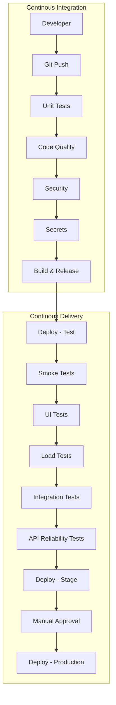

# CI/CD 

Continuous integration (CI) and continuous delivery (CD) are software development practices that require developers to frequently merge their code changes into a central repository where builds and tests are run.

## CI/CD pipelines

**Continuous Integration:**
1. Software development practice where developers regularly merge their code changes into a central repository, after which automated builds and tests are run.
1. Entails both an automation component (e.g., a CI or build service) and a cultural component (e.g., learning to integrate frequently).
1. A continuous integration tooling ecosystem must automatically build and runs unit/integration tests, code quality checks, security checks, secrets check on the new code changes to immediately surface any errors.

**Continuous Delivery:**
1. Software development practice where code changes are automatically prepared for a release to production
1. Expands upon continuous integration by deploying all code changes to a testing environment and/or a production environment after the build, unit test and code quality check stage
1. Continuous delivery mandates automated testing (UI testing, load testing, integration testing, API reliability testing,) beyond unit tests and code quality checks.
1. With continuous delivery, every code change is built, tested, and then pushed to a non-production testing or staging environment. There can be multiple, parallel test stages before a production deployment. 
1. In continuous delivery, there is an explicit manual approval to deploy to Production

**Continuous Deployment:**
1. In continuous deployment, there will no explicit manual approval to deployment to Production is required

## CI/CD pipeline 

Mermaid CI/CD pipeline diagram

## CI/CD pipeline with Kubernetes

With Kubernetes, it’s easy to implement an in-cluster CI/CD pipeline. 
You can have CI software create the container image representing your application and store it in a container image registry. 

Afterward, a Git workflow such as a pull request can change the Kubernetes manifests illustrating the deployment of your apps and start a CD sync loop.

## GitOps loop

Is composed of four main actions

1. **Deploy:** Deploy the manifests from Git.
1. **Monitor:** Monitor either the Git repo or the cluster state.
3. **Detect drift:** Detect any change from what is described in Git and what is present in the cluster.
4. **Take action:** Perform an action that reflects what is on Git (rollback or three-way diff). Git is the source of truth, and any change is performed via a Git workflow.

## GitOps loop with Kubernetes

In Kubernetes, application deployment using the GitOps approach makes use of at least two Git repositories: 

1. app source code, and 
1. Kubernetes manifests describing the app’s deployment (Deployment, Service, etc.).

Outline of the GitOps loop with Kubernetes

1. App source code repository
2. CI pipeline creating a container image
3. Container image registry
4. Kubernetes manifests repository
5. GitOps engine syncing manifests to one or more clusters and detecting drifts