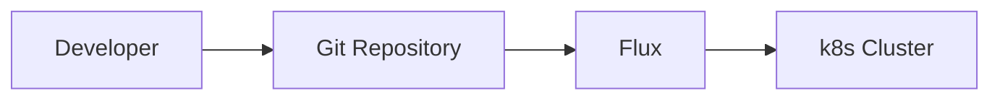

# GitOps

GitOps is a methodology and practice that uses Git repositories as a single source of truth to deliver infrastructure as code. 

The three pillars of GitOps are:
1. Git is the single source of truth
1. Treat everything as code
1. Operations are performed through Git workflows

## GitOps Workflow

The GitOps workflow is as follows:

1. A developer makes a change to the Git repository
1. Flux deployed in k8s cluster detects the change 
1. Flux applies the change to the k8s cluster

GitOps Workflow mermaid diagram:

## GitOps Principles

The GitOps principles are as follows:

1. Declarative - A [software system](https://github.com/open-gitops/documents/blob/v1.0.0/GLOSSARY.md#software-system) managed by GitOps must have its desired state expressed [declaratively](https://github.com/open-gitops/documents/blob/v1.0.0/GLOSSARY.md#declarative-description).
1. Versioned and Immutable - Desired state is [stored](https://github.com/open-gitops/documents/blob/v1.0.0/GLOSSARY.md#state-store) in a way that enforces immutability, versioning and retains a complete version history.
1. Pulled Automatically - Software agents automatically pull the desired state declarations from the source.
1. Continuously Reconciled - Software agents [continuously](https://github.com/open-gitops/documents/blob/v1.0.0/GLOSSARY.md#continuous) observe actual system state and [attempt to apply](https://github.com/open-gitops/documents/blob/v1.0.0/GLOSSARY.md#reconciliation) the desired state.

## Why GitOps?

Using the common Git-based workflows that developers are familiar with, GitOps expands upon existing processes from application development to deployment, app lifecycle management, and infrastructure configuration.

Every change throughout the application lifecycle is traced in the Git repository and is auditable. This approach is beneficial for both developers and operations teams as it enhances the ability to trace and reproduce issues quickly, improving overall security. One key point is to reduce the risk of unwanted changes (drift) and correct them before they go into production.

**Advantages for GitOps:**

1. **Standard workflow:** Use familiar tools and Git workflows from application development teams
1. **Enhanced security:** Review changes beforehand, detect configuration drifts, and take action
1. **Visibility and audit:** Capture and trace any change to clusters through Git history
1. **Multicluster consistency:** Reliably and consistently configure multiple environments and multiple Kubernetes clusters and deployment

## Gitops with Flux

Flux is a tool that automatically ensures that the state of a cluster matches the config in git. It uses a GitOps approach to do so.

## Flux in Short

|     |     |
| --- | --- |
| 🤝 Flux provides GitOps for both apps and infrastructure | Flux and Flagger deploy apps with canaries, feature flags, and A/B rollouts. Flux can also manage any Kubernetes resource. Infrastructure and workload dependency management is built in. |
| 🤖 Just push to Git and Flux does the rest | Flux enables application deployment (CD) and (with the help of Flagger) progressive delivery (PD) through automatic reconciliation. Flux can even push back to Git for you with automated container image updates to Git (image scanning and patching). |
| 🔩 Flux works with your existing tools | Flux works with your Git providers (GitHub, GitLab, Bitbucket, can even use s3-compatible buckets as a source), all major container registries, and all CI workflow providers. |
| 🔒 Flux is designed with security in mind | Pull vs. Push, least amount of privileges, adherence to Kubernetes security policies and tight integration with security tools and best-practices. Read more about [our security considerations](/flux/security). |
| ☸️ Flux works with any Kubernetes and all common Kubernetes tooling |  Kustomize, Helm, RBAC, and policy-driven validation (OPA, Kyverno, admission controllers) so it simply falls into place. |
| 🤹 Flux does Multi-Tenancy (and “Multi-everything”) | Flux uses true Kubernetes RBAC via impersonation and supports multiple Git repositories. Multi-cluster infrastructure and apps work out of the box with Cluster API: Flux can use one Kubernetes cluster to manage apps in either the same or other clusters, spin up additional clusters themselves, and manage clusters including lifecycle and fleets. |
| 📞 Flux alerts and notifies | Flux provides health assessments, alerting to external systems, and external events handling. Just “git push”, and get notified on Slack and [other chat systems](/flux/components/notification/provider/). |
| 👍 Users trust Flux | Flux is a CNCF Graduated project and was categorised as "Adopt" on the [CNCF CI/CD Tech Radar](https://radar.cncf.io/2020-06-continuous-delivery) (alongside Helm). |
| 💖 Flux has a lovely community that is very easy to work with! | We welcome contributors of any kind. The components of Flux are on Kubernetes core `controller-runtime`, so anyone can contribute and its functionality can be extended very easily. |

## For Flux End to End

[Flux from End-to-End](https://fluxcd.io/flux/flux-e2e/)