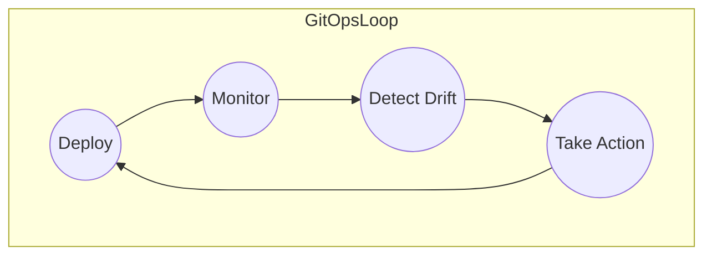

# GitOps

GitOps is a methodology and practice that uses Git repositories as a single source of truth to deliver infrastructure as code. 

The three pillars of GitOps are:
1. Git is the single source of truth
1. Treat everything as code
1. Operations are performed through Git workflows

## GitOps Workflow

The GitOps workflow is as follows:

1. A developer makes a change to the Git repository
1. Flux deployed in k8s cluster detects the change 
1. Flux applies the change to the k8s cluster

GitOps Workflow mermaid diagram:

## GitOps Principles

The GitOps principles are as follows:

1. Declarative - A [software system](https://github.com/open-gitops/documents/blob/v1.0.0/GLOSSARY.md#software-system) managed by GitOps must have its desired state expressed [declaratively](https://github.com/open-gitops/documents/blob/v1.0.0/GLOSSARY.md#declarative-description).
1. Versioned and Immutable - Desired state is [stored](https://github.com/open-gitops/documents/blob/v1.0.0/GLOSSARY.md#state-store) in a way that enforces immutability, versioning and retains a complete version history.
1. Pulled Automatically - Software agents automatically pull the desired state declarations from the source.
1. Continuously Reconciled - Software agents [continuously](https://github.com/open-gitops/documents/blob/v1.0.0/GLOSSARY.md#continuous) observe actual system state and [attempt to apply](https://github.com/open-gitops/documents/blob/v1.0.0/GLOSSARY.md#reconciliation) the desired state.

## Why GitOps?

Using the common Git-based workflows that developers are familiar with, GitOps expands upon existing processes from application development to deployment, app lifecycle management, and infrastructure configuration.

Every change throughout the application lifecycle is traced in the Git repository and is auditable. This approach is beneficial for both developers and operations teams as it enhances the ability to trace and reproduce issues quickly, improving overall security. One key point is to reduce the risk of unwanted changes (drift) and correct them before they go into production.

**Advantages for GitOps:**

1. **Standard workflow:** Use familiar tools and Git workflows from application development teams
1. **Enhanced security:** Review changes beforehand, detect configuration drifts, and take action
1. **Visibility and audit:** Capture and trace any change to clusters through Git history
1. **Multicluster consistency:** Reliably and consistently configure multiple environments and multiple Kubernetes clusters and deployment

## GitOps loop

Is composed of four main actions

1. **Deploy:** Deploy the manifests from Git.
1. **Monitor:** Monitor either the Git repo or the cluster state.
3. **Detect drift:** Detect any change from what is described in Git and what is present in the cluster.
4. **Take action:** Perform an action that reflects what is on Git (rollback or three-way diff). Git is the source of truth, and any change is performed via a Git workflow.

## GitOps loop with Kubernetes

In Kubernetes, application deployment using the GitOps approach makes use of at least two Git repositories: 

1. app source code, and 
1. Kubernetes manifests describing the app’s deployment (Deployment, Service, etc.).

Outline of the GitOps loop with Kubernetes

1. App source code repository
2. CI pipeline creating a container image
3. Container image registry
4. Kubernetes manifests repository
5. GitOps engine syncing manifests to one or more clusters and detecting drifts