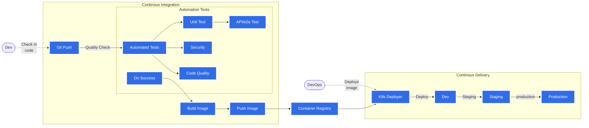

# CI/CD 

Continuous integration (CI) and continuous delivery (CD) are software development practices that require developers to frequently merge their code changes into a central repository where builds and tests are run.

## CI/CD pipelines

**Continuous Integration:**
1. Software development practice where developers regularly merge their code changes into a central repository, after which automated builds and tests are run.
1. Entails both an automation component (e.g., a CI or build service) and a cultural component (e.g., learning to integrate frequently).
1. A continuous integration tooling ecosystem must automatically build and runs unit/integration tests, code quality checks, security checks, secrets check on the new code changes to immediately surface any errors.

**Continuous Delivery:**
1. Software development practice where code changes are automatically prepared for a release to production
1. Expands upon continuous integration by deploying all code changes to a testing environment and/or a production environment after the build, unit test and code quality check stage
1. Continuous delivery mandates automated testing (UI testing, load testing, integration testing, API reliability testing,) beyond unit tests and code quality checks.
1. With continuous delivery, every code change is built, tested, and then pushed to a non-production testing or staging environment. There can be multiple, parallel test stages before a production deployment. 
1. In continuous delivery, there is an explicit manual approval to deploy to Production

**Continuous Deployment:**
1. In continuous deployment, there will no explicit manual approval to deployment to Production is required

## CI/CD pipeline 

Continous Integration and Continous Deployment pipeline in mermaid

## CI/CD pipeline with Kubernetes

With Kubernetes, it’s easy to implement an in-cluster CI/CD pipeline. 
You can have CI software create the container image representing your application and store it in a container image registry. 

Afterward, a Git workflow such as a pull request can change the Kubernetes manifests illustrating the deployment of your apps and start a CD sync loop.

[GitOps](./GitOps.md) is a way to do CI/CD on Kubernetes. It uses Git as a single source of truth for declarative infrastructure and applications.

